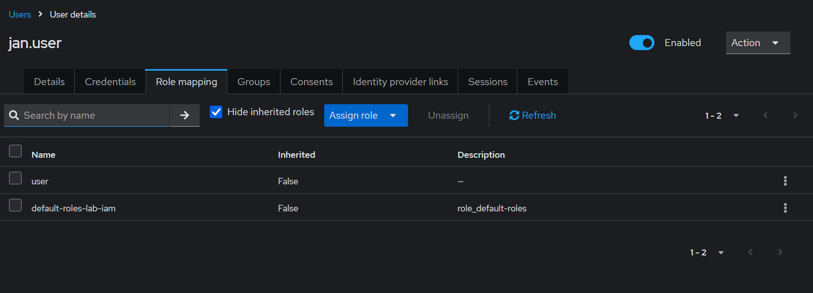
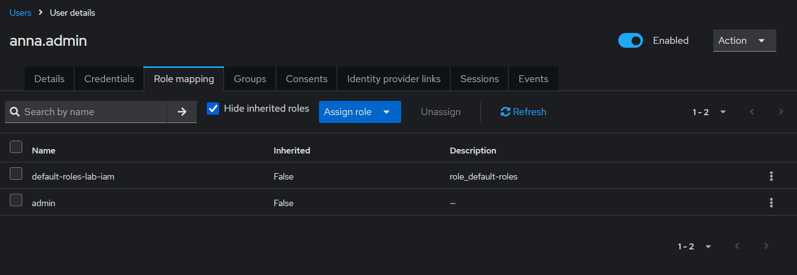
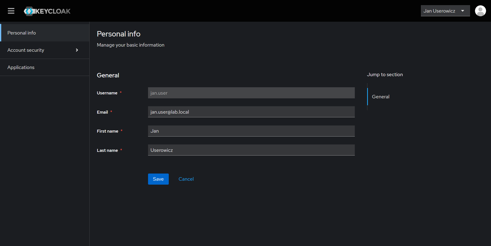
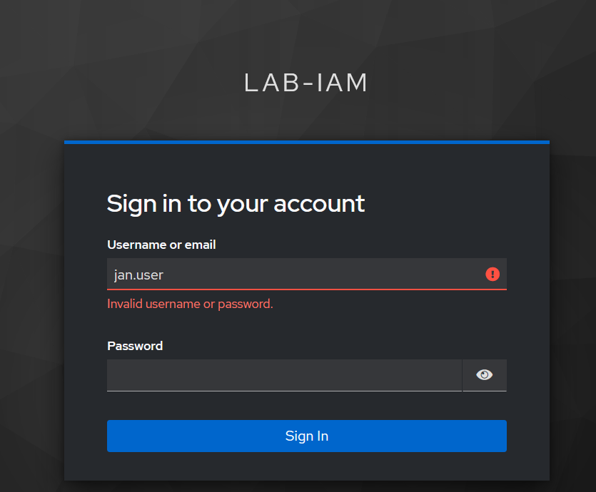
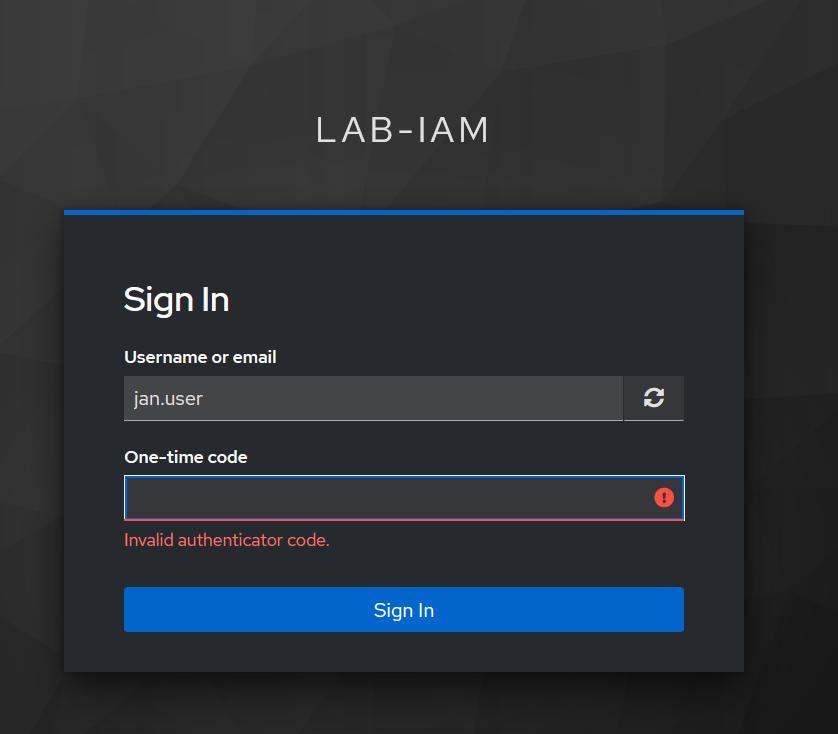
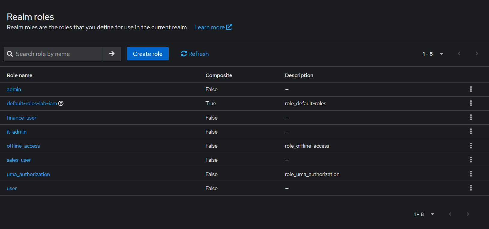
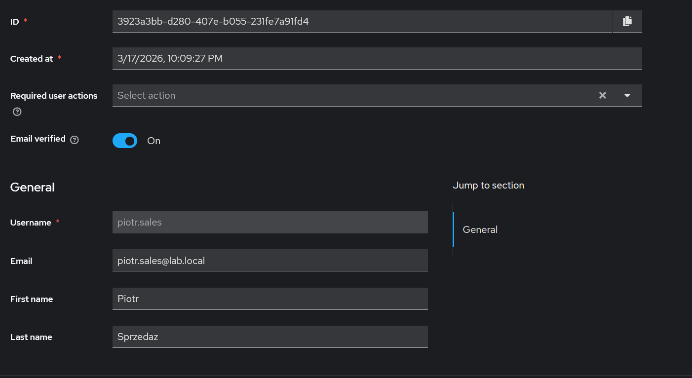
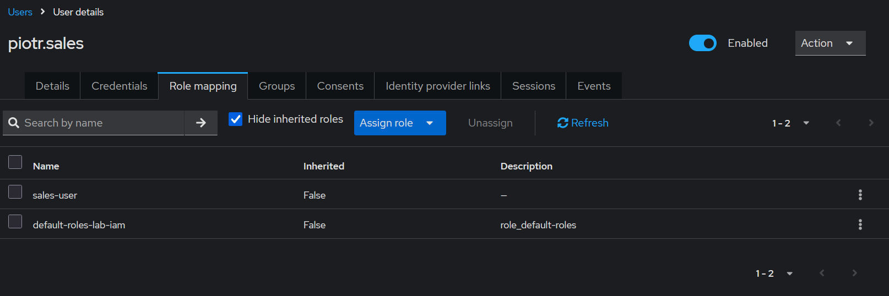
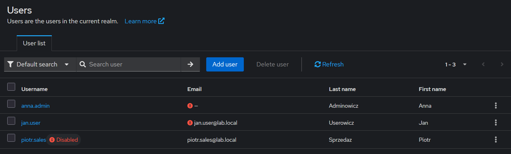
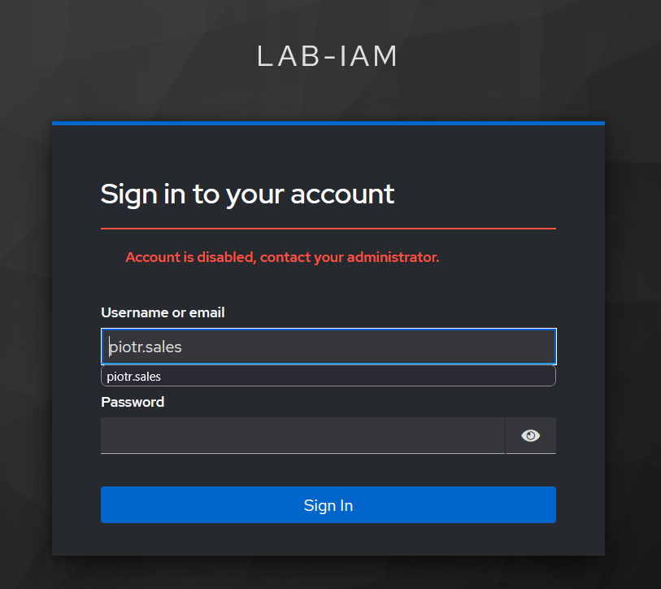

# Lab 01: IAM - Keycloak MFA

## Introduction

The aim of this lab was to practically implement the basic mechanisms of identity and access management in an IAM environment based on Keycloak. As part of the exercise, a Keycloak server was launched, a custom test realm was created, user roles were configured and assigned to test accounts, and multi-factor authentication was enforced for a selected user.

Unlike previous labs focused on system logs and event detection in a SIEM, this module concentrated on the identity layer. The main objective was to demonstrate that access control does not end with a password alone, but also includes proper role separation, the principle of least privilege, a second authentication factor, and the ability to audit both user and administrator activity.

The environment was launched on an Ubuntu server using Docker. The administrative interface and user logins were accessed through a web browser on a Windows 11 host.

## Environment and Tools

- IAM server: Keycloak running in a Docker container on Ubuntu Linux
- Authentication mechanism: local user accounts in the `lab-iam` realm
- Authorization mechanism: realm roles and business roles
- MFA mechanism: OTP configured for the user `jan.user`
- Audit: `User events` and `Admin events` in Keycloak
- Administrative interface and login testing: web browser

## 1. Launching the Keycloak Environment

The first step was to prepare the containerized environment on the Ubuntu server and launch a Keycloak instance. The service was exposed on port `8080`, which made it possible to access the administrative panel from the host system.

Next, a custom realm named `lab-iam` was created so that work would not be performed directly in the default `master` realm. Thanks to this, all subsequent configurations of users, roles, and policies applied to a separate test environment.

## 2. Role Configuration and RBAC Basics

Within the `lab-iam` realm, two basic roles were created:

- `user`
- `admin`

Then, two test accounts were prepared:

- `jan.user`
- `anna.admin`

The `user` role was assigned to `jan.user`, while the `admin` role was assigned to `anna.admin`. This division provides a simple demonstration of the RBAC model, in which different users receive different levels of access depending on their function.

From a security perspective, this setup reflects the principle of least privilege. A regular user is assigned only a basic role, while administrative privileges are separated into a dedicated account.

## 3. Enforcing MFA for the User `jan.user`

The next step was to strengthen the security of the login process by enabling multi-factor authentication. For the user `jan.user`, the required action `Configure OTP` was set, which forced the user to configure a one-time password during the next login.

During the first login, the user went through the OTP setup process using a QR code and was then asked to enter a one-time code generated by an authenticator application. After MFA was configured successfully, the user was able to access the account.

This mechanism demonstrates that a password alone is not the only component of access control. Even if login credentials are obtained by an unauthorized person, the lack of a second factor makes successful account takeover much more difficult.

## 4. Failed Login Tests

To prepare material for audit analysis, two failed login tests were also performed.

The first test involved entering an incorrect password for the user `jan.user`. The login interface returned the message `Invalid username or password.`

The second test involved entering an incorrect OTP one-time code. In this case, Keycloak returned the message `Invalid authenticator code.`

Both tests were significant from an IAM perspective because they demonstrated two different types of authentication failures: an error in the primary login credentials and an error in the second MFA factor. This distinction is important during auditing and the analysis of security events.

## 5. Analysis of User Audit Logs

After enabling user event logging in Keycloak, the login tests were repeated to verify what information would appear in the audit logs.

In the `User events` section, the following event types were recorded, among others:

- `LOGIN`
- `LOGIN_ERROR`
- `CODE_TO_TOKEN`
- `UPDATE_PROFILE`
- `LOGOUT`

The event list showed that Keycloak records both successful logins and failed access attempts. In the details of one of the failed login events, the `error` field was visible with the value `invalid_user_credentials`, along with information about the client, authentication method, and IP address. This makes it possible to reconstruct the course of a user session and distinguish between successful and failed stages of authentication.

From an analytical perspective, what is particularly important is that IAM auditing is not limited to a simple login result entry, but also includes additional context necessary for interpreting the event.

## 6. Extending the Lab with an IAM Lifecycle Scenario

After configuring the basic RBAC and MFA model, the lab was extended with a simple IAM user lifecycle scenario. The goal of this part was to demonstrate three fundamental administrative operations:

- `Joiner` — creating a new user and assigning a role
- `Mover` — changing the scope of access by replacing a role
- `Leaver` — disabling an account and revoking the ability to log in

Unlike a purely descriptive process model, this scenario was carried out directly in Keycloak and left traces in both `Admin events` and `User events`.

### 6.1 Joiner

In the first step, a new user `piotr.sales` was created, representing a new employee in the sales department. Basic identity data was configured for the account, and the business role `sales-user` was assigned.

Additionally, the following roles were defined in the realm:

- `sales-user`
- `finance-user`
- `it-admin`

The `Joiner` scenario demonstrated a standard onboarding case: creating an account, setting basic attributes, and assigning a baseline role appropriate to the job position.

### 6.2 Mover

In the second step, a change of position for the user `piotr.sales` was simulated. The `sales-user` role was removed from the user, and the `finance-user` role was then assigned.

This was the most important element of the `Mover` scenario because it shows that a change of position should not rely solely on adding new privileges. A proper lifecycle model also requires removing old access rights that are no longer business-justified.

In `Admin events`, both `CREATE` and `DELETE` events appeared for role mapping, which made it possible to clearly confirm the change in access scope.

### 6.3 Leaver

In the third step, an employee leaving the organization was simulated. The account `piotr.sales` was disabled, which immediately prevented any further login.

After disabling the account, a login attempt was made for `piotr.sales`. Keycloak returned the message `Account is disabled, contact your administrator.` In `User events`, a `LOGIN_ERROR` entry appeared, and the event details showed the `error` field with the value `user_disabled`.

The `Leaver` scenario demonstrates the most fundamental and at the same time one of the most important IAM operations from a security perspective: quickly cutting off access to the system after the end of employment or cooperation.

## 7. Mini Case Studies

### 7.1 RBAC and the Principle of Least Privilege

In the test environment, a simple RBAC model was initially applied using the `user` and `admin` roles, and then extended with the business roles `sales-user`, `finance-user`, and `it-admin`. The user `jan.user` was assigned a basic role, `anna.admin` a privileged role, and `piotr.sales` a business role resulting from the job function. This setup demonstrates the practical application of the principle of least privilege, according to which a user should only have the level of access necessary to perform assigned tasks.

### 7.2 IAM Event Analysis

In the Keycloak audit logs, a failed login attempt was recorded as a `LOGIN_ERROR` event. Depending on the scenario, the details showed values such as `invalid_user_credentials` and `user_disabled`. In practice, this makes it possible to distinguish between an ordinary user mistake and a situation where the account had previously been blocked or disabled. This type of distinction is important during the analysis of access attempts and when verifying whether an error results from user behavior or from an intentional administrative change.

## Module Conclusions

- Keycloak makes it possible to build a test IAM environment covering users, roles, and login policies in a straightforward way.
- Separating the `user` and `admin` roles provides a basic but important demonstration of the RBAC model and the principle of least privilege.
- Enforcing `Configure OTP` showed that MFA can be implemented directly at the identity management platform level.
- Tests with an incorrect password and an incorrect OTP code demonstrated different classes of authentication errors, which are later visible in audit logs.
- Extending the lab with the `Joiner / Mover / Leaver` scenario demonstrated that IAM is not only about logging in, but also about the entire user lifecycle.
- `Admin events` and `User events` make it possible to trace both administrator actions and the effects of those actions on the end user side.
