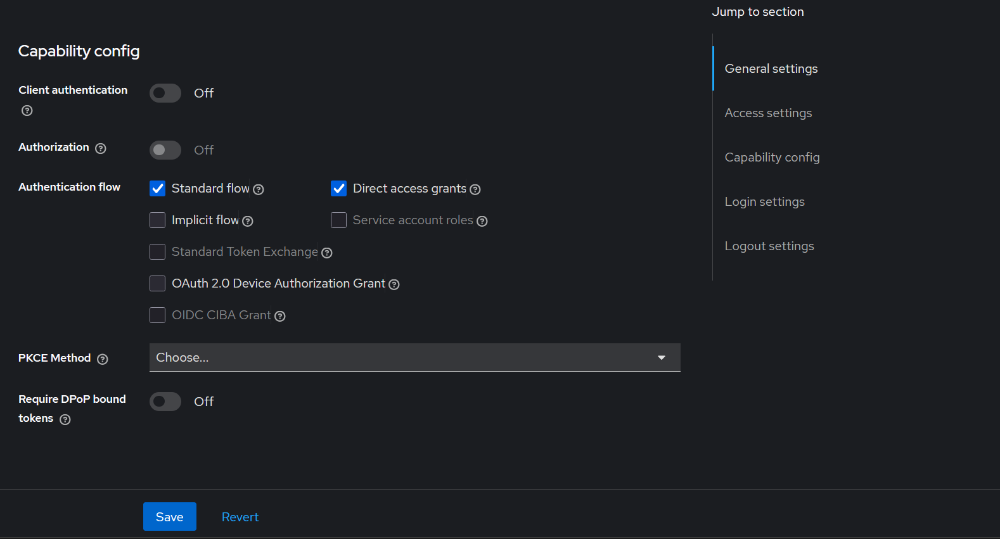
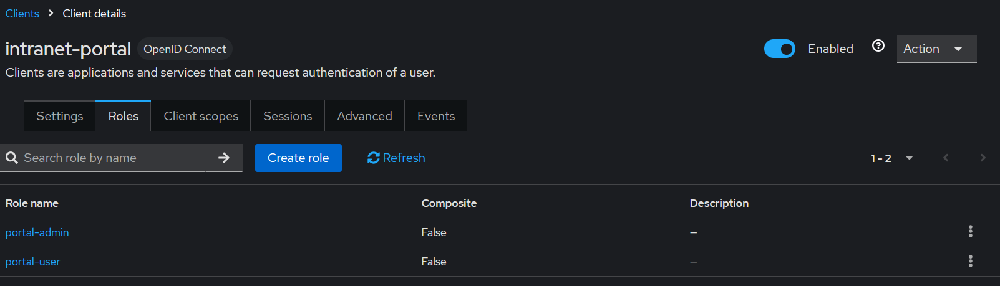
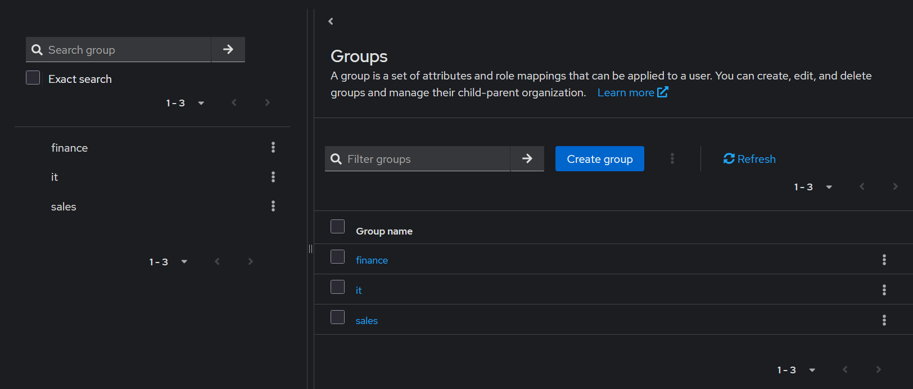
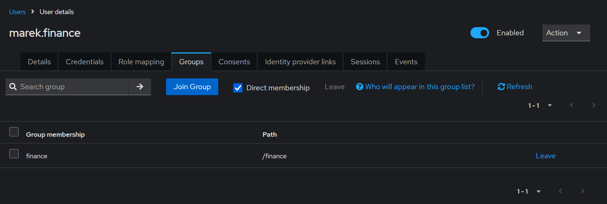
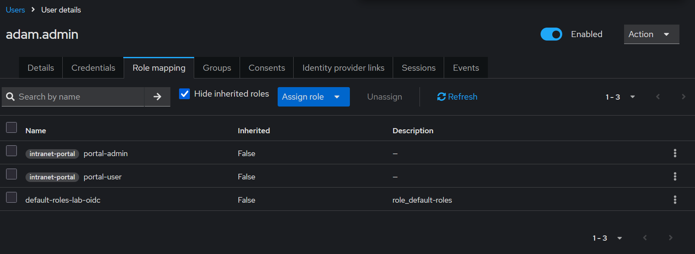
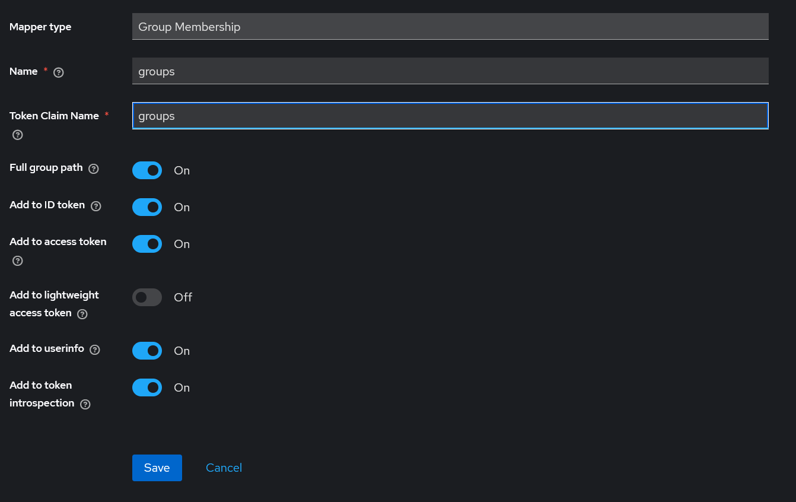
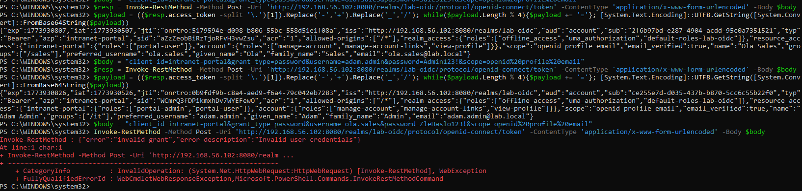
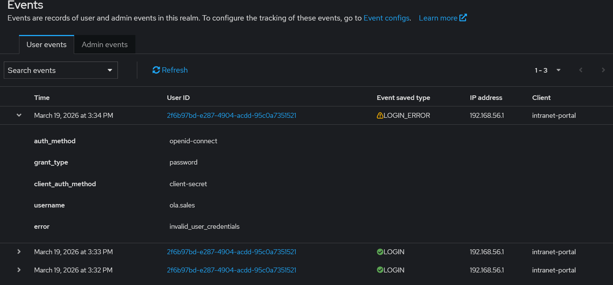

# Lab 02: IAM - IAM Processes

## Introduction

The purpose of this lab was to move practically from basic user administration in Keycloak to configuring an OIDC client, working with groups, client roles, and analyzing the contents of access tokens. Unlike the previous module, which focused mainly on realm roles, MFA, and simple lifecycle scenarios, this lab concentrated on the integration aspect of IAM.

The main objective of the exercise was to demonstrate that proper identity configuration does not end with creating a user in the administrative panel. It is equally important to determine what information will be included in the token, which roles will be assigned to a specific client, and how user groups can be transferred into claims later used by applications.

As part of the exercise, a new test realm called `lab-oidc` was created, the `intranet-portal` client was configured, client roles and organizational groups were created, and a set of test users was prepared. Then, tokens were obtained for users with different privilege levels, and their contents were analyzed. Finally, a failed login test was also performed, and the traces of that event were examined in the Keycloak audit logs.

## Environment and Tools

- IAM server: Keycloak running on Ubuntu Linux
- Test realm: `lab-oidc`
- Protocol: OpenID Connect
- Client: `intranet-portal`
- Testing mechanism: no custom application, using the OIDC token endpoint
- Permission types: groups and client roles
- Audit: `User events` in Keycloak
- Operating environment: web browser and PowerShell on Windows 11

## 1. Creating a New Realm and OIDC Client

The first step was to create a separate realm called `lab-oidc` in order to isolate the exercise from previous IAM configurations. Then, within that realm, an OpenID Connect client named `intranet-portal` was created.

In the client configuration, `Standard flow` and `Direct access grants` were enabled, while `Client authentication` and `Authorization` were disabled. This setup was an intentional simplification for lab purposes. It made it possible to manually obtain tokens for users from PowerShell and directly analyze claims without the need to build a separate web application.

From a learning perspective, this stage was important because it demonstrated the practical difference between simply having a user in IAM and preparing a client that can actually use OIDC mechanisms.

## 2. Defining Client Roles

In the next step, client roles assigned directly to `intranet-portal` were created:

- `portal-user`
- `portal-admin`

This was an important distinction compared to the previous lab. Earlier, the focus was mainly on realm roles, while here client-specific roles were used. This approach better reflects real IAM deployments, where different applications have their own set of permissions and their own authorization logic.

The `portal-user` role represented basic access, while `portal-admin` extended permissions with an administrative level within the client.

## 3. Creating Organizational Groups

In the `lab-oidc` realm, three groups corresponding to example departments within an organization were created:

- `sales`
- `finance`
- `it`

These groups served as an organizational attribute of the user and were intended to be later transferred into the token as the `groups` claim. In practice, such data is particularly useful for building access policies, segmenting users, or mapping identities to an application's business logic.

It is worth emphasizing that groups and roles solve different problems. A group describes organizational membership, while a role describes the level of access or a set of permissions.

## 4. Creating Users and Assigning Permissions

For the purposes of the lab, three test users were prepared:

- `ola.sales`
- `marek.finance`
- `adam.admin`

Each user was assigned to the appropriate organizational group:

- `ola.sales` → `sales`
- `marek.finance` → `finance`
- `adam.admin` → `it`

At the same time, client roles were assigned to them:

- `ola.sales` → `portal-user`
- `marek.finance` → `portal-user`
- `adam.admin` → `portal-user`, `portal-admin`

This model reflects a typical IAM scenario in which a user's identity is described both by their place in the organizational structure and by the set of technical permissions they have in a specific application.

The screenshot below shows the membership of `marek.finance` in the `finance` group, while the next one shows the client role assignments for the administrative user `adam.admin`.

## 5. Adding Groups to the Token Using a Mapper

Simply creating groups in Keycloak does not yet mean that the application or OIDC client will see them in the token. For this reason, a separate mapper of type `Group Membership` was added and configured to transfer group membership into the `groups` claim.

The following settings were configured in the mapper:

- `Token Claim Name` = `groups`
- `Full group path` = enabled
- add to `ID token`
- add to `access token`
- add to `userinfo`

Then, the scope containing this mapper was attached to the `intranet-portal` client as a default scope. This was a key part of the lab because, without this step, groups would not have appeared in users' tokens.

From a practical perspective, this was the most important moment of the entire exercise: demonstrating that Keycloak not only stores user data, but is also able to pass it on to the client in the form of useful claims.

## 6. Retrieving and Analyzing User Tokens

After the configuration was completed, tests were performed to retrieve tokens from the OIDC endpoint:

`/realms/lab-oidc/protocol/openid-connect/token`

The `intranet-portal` client and the credentials of the test users were used to obtain the tokens. This made it possible to directly verify what information Keycloak includes in the `access_token`.

### 6.1 Token of the User `ola.sales`

In the case of the user `ola.sales`, analysis of the payload confirmed the presence of the most important claims:

- `preferred_username` = `ola.sales`
- `groups` containing `sales`
- `resource_access.intranet-portal.roles` containing `portal-user`

This confirmed that a regular user receives correct identification, the appropriate organizational group, and the basic client role.

### 6.2 Token of the User `adam.admin`

For the user `adam.admin`, the token payload contained:

- `preferred_username` = `adam.admin`
- `groups` containing `it`
- `resource_access.intranet-portal.roles` containing `portal-user` and `portal-admin`

In this way, it was clearly demonstrated that users with different access levels receive different sets of claims in the token. This is the element that best illustrates the practical purpose of IAM configuration: it is not just about an entry in the administrative panel, but about the actual set of data passed to the client and later used by authorization mechanisms.

## 7. Failed Login Test

In the next step, an attempt was made to obtain a token for the user `ola.sales` using an incorrect password. The endpoint returned the following error:

- `invalid_grant`
- `Invalid user credentials`

This test had two purposes. First, it allowed verification of how the token endpoint behaves when incorrect credentials are provided. Second, it prepared material for analyzing the audit logs on the Keycloak side.

From a security perspective, this is important because it shows that Keycloak records not only successful token issuance operations, but also failed attempts to gain access.

## 8. Analysis of User Events in Keycloak

After enabling user event logging in the `lab-oidc` realm, the successful and failed login tests were repeated, and then the `User events` tab was analyzed.

Among the entries that appeared in the logs were:

- `LOGIN`
- `LOGIN_ERROR`

In the details of the failed login event, the following data was visible:

- `auth_method` = `openid-connect`
- `grant_type` = `password`
- `username` = `ola.sales`
- `error` = `invalid_user_credentials`

This was a very important result of the lab because it confirmed the ability to correlate user actions with a specific OIDC client and a specific authentication error. This makes it possible to distinguish a successful token issuance from a situation in which the user entered incorrect credentials and did not gain access.

## 9. Mini Case Studies

### 9.1 Comparing a Regular User and an Administrator in the Token

In the lab, the tokens of two accounts were compared: `ola.sales` and `adam.admin`. Both tokens contained the user’s identity and organizational group, but they differed in the contents of the `resource_access` section. The regular user had only the `portal-user` role, while the administrator had both `portal-user` and `portal-admin`. This demonstrates the practical application of authorization based on client roles.

### 9.2 Analysis of an Authentication Error

The failed attempt to obtain a token for `ola.sales` resulted in the `invalid_grant` response, and in the Keycloak logs a `LOGIN_ERROR` entry was recorded with the field `error = invalid_user_credentials`. This case shows that even without building a separate application, it is possible to practice and document a complete failed login scenario in the OIDC protocol.

## Module Conclusions

- Keycloak can serve not only as an account management panel, but also as a real identity provider for an OIDC client.
- Client roles better reflect application-level permissions than realm roles used in simple administrative scenarios.
- User groups can be effectively transferred into the token through the `Group Membership` mapper.
- Analyzing the token payload makes it possible to directly verify what information an application receives after user authentication.
- The difference between a regular user and an administrator is visible not only in the Keycloak panel, but above all in the claims embedded in the token.
- The OIDC token endpoint can be used as a simple testing mechanism for practicing IAM configuration without the need to build a custom application.
- `User events` logs make it possible to trace both successful logins and failed attempts to obtain a token.
