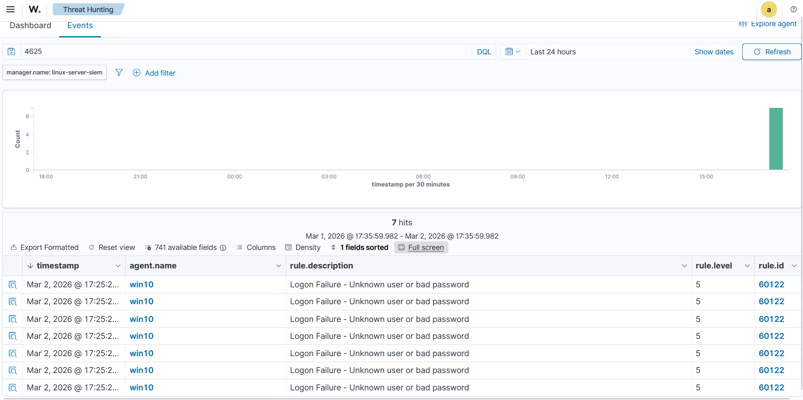
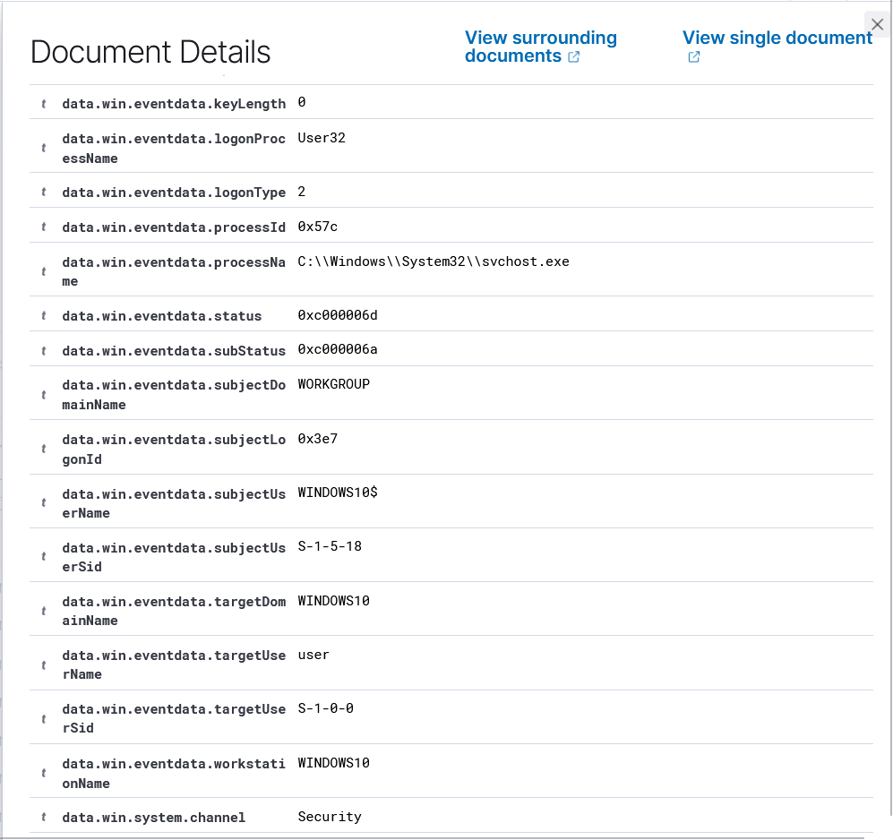
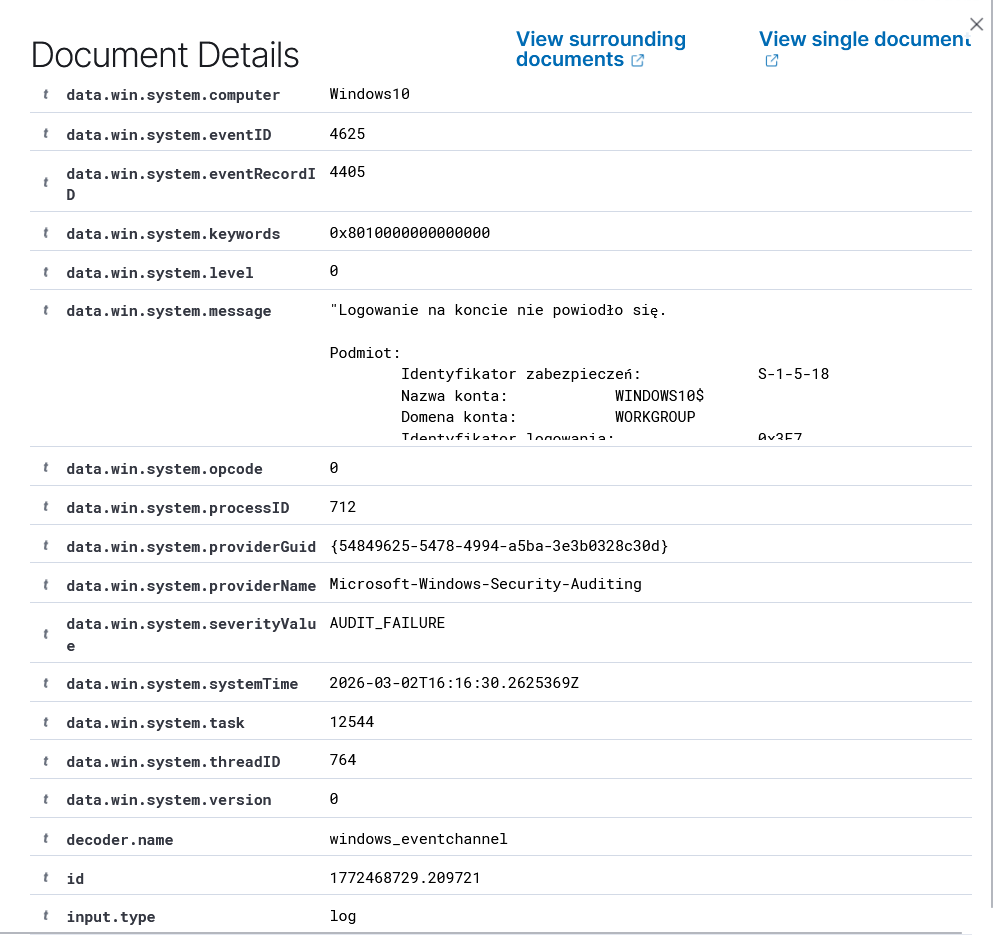
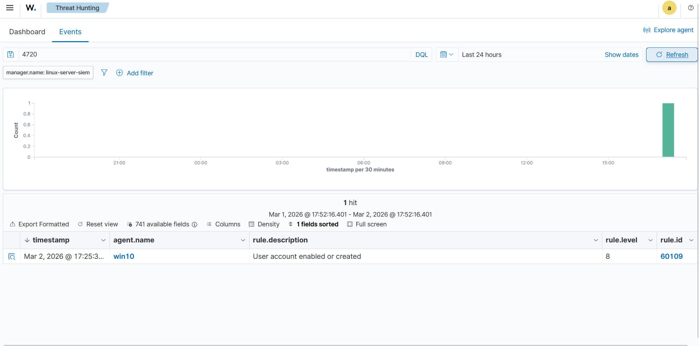
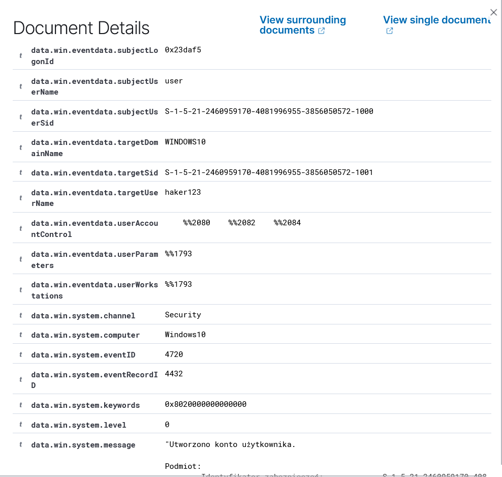
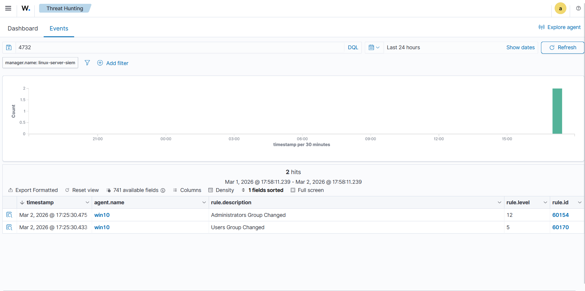
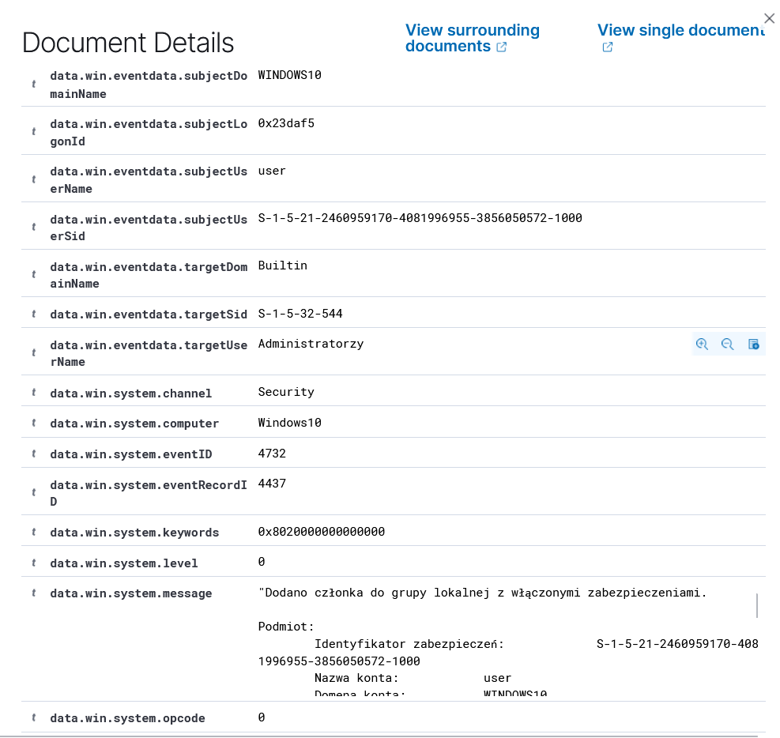
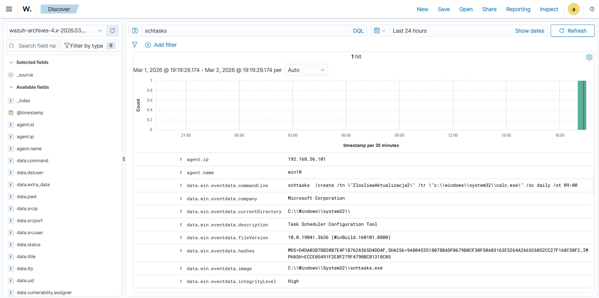

# Lab 01: Mini-SOC

## Introduction

The purpose of this lab was to build a simple Mini-SOC environment based on Wazuh and verify whether it correctly collects security logs from a Windows 10 system. As part of the exercise, three scenarios were simulated: a series of failed login attempts, the creation of a new account followed by adding it to the Administrators group, and the creation of a scheduled task. The first two scenarios were detected directly by Wazuh’s built-in rules. The third required log pipeline analysis and access to raw data in the archival index. This demonstrated the limitations of default detection and the need to create custom rules in the next stage of the project.

The environment consisted of two virtual machines:

- Ubuntu Server with Wazuh Manager, Wazuh Dashboard, Wazuh Indexer, and Filebeat
- Windows 10 with the Wazuh agent and Sysmon

Logs from the Windows endpoint were sent to the Wazuh manager, then indexed and displayed in the dashboard. For raw log analysis, the `wazuh-archives-*` index was also used.

Environment and tools:

- SIEM server: Wazuh Manager & Dashboard
- Endpoint: Windows 10 with the Wazuh agent installed
- Telemetry: Windows Event Logs, Sysmon
- Data processing: Filebeat, OpenSearch

Attack scenarios and detection:

## 1. Brute-Force Attack

As part of the test, a series of failed login attempts was performed against the local `user` account.

In the Wazuh dashboard, alerts related to event 4625 appeared. Analysis of the details showed that the `SubStatus` field contained the value `0xc000006a`, which indicates the use of a valid existing account name with an incorrect password.

The scenario confirmed that the environment correctly records failed login attempts and provides data that makes it possible to distinguish between an ordinary user mistake and a more deliberate password-guessing attempt.

## 2. Account Creation and Addition to the Administrators Group

In the next scenario, a new local user account was created and then added to the Administrators group.

First, Wazuh recorded event 4720, which indicates the creation of a new account. Shortly afterward, event 4732 appeared, indicating that the user had been added to a local security group. Both entries occurred within a short time frame and formed a single chain of actions.

The analysis showed that the environment correctly records both the creation of a new user and the change in that user’s privileges. From a security perspective, such a sequence may indicate an attempt to obtain persistent privileged access to the system.

## 3. Persistence via Scheduled Task and Pipeline Troubleshooting

To simulate persistence, a scheduled task was created using the `schtasks` command, which launched `calc.exe` at a specified time.

The event did not appear in the standard Wazuh alerts view, even though Sysmon was functioning correctly. This meant that the problem was not related to log generation on the endpoint itself, but rather to a later stage of data processing.

As part of the troubleshooting process, full log archiving was enabled through `logall_json`, archive forwarding was activated with `archives.enabled: true`, and the `wazuh-archives-*` index was added in the dashboard. After these changes, a raw Sysmon log containing the full `schtasks /create ...` command was found in the Discover tab.

This scenario showed that the absence of an alert does not mean the absence of an event. In practice, an analyst must understand the entire log pipeline and be able to move from the alerts view to raw data.

## Module Conclusions

- Relying solely on the default built-in SIEM rules is insufficient, because many potentially dangerous actions may be classified as informational events and remain hidden from the analyst.

- Understanding the entire log processing pipeline (`Endpoint -> Manager -> Filebeat -> Indexer`) is crucial for effective threat hunting on raw data. This naturally leads to the next step: creating custom detection rules.

## Module Conclusions

- Relying only on the default built-in SIEM rules is insufficient, because some potentially important actions may not appear in the main alerts view.

- Understanding the entire log processing pipeline from the endpoint to the index is essential for effective event analysis and threat hunting.

A natural next step is to create custom detection rules in Wazuh, especially for scheduled tasks.
