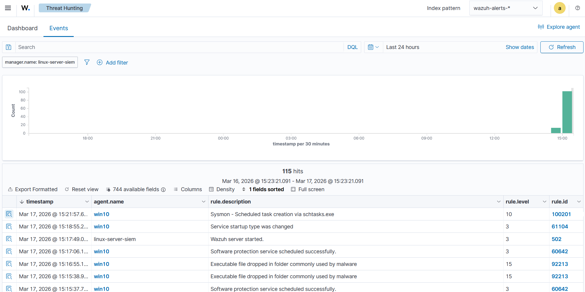
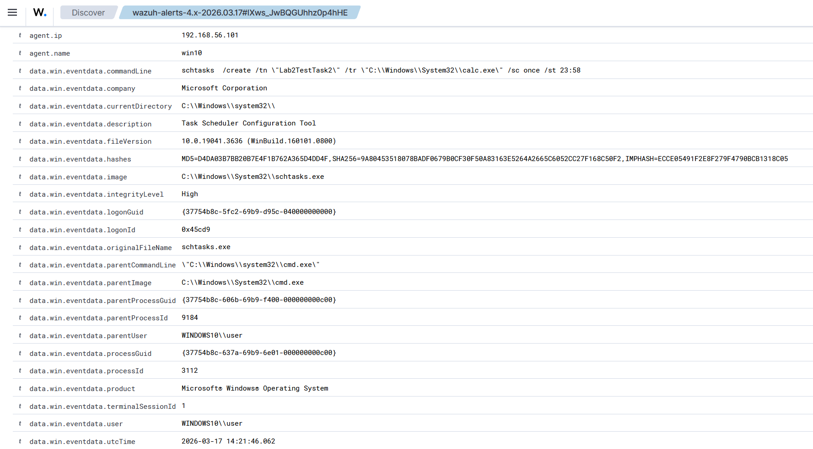
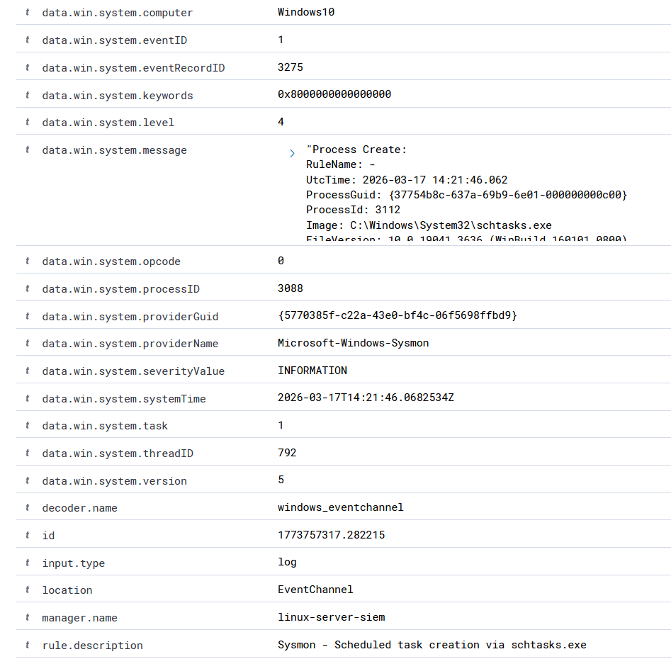
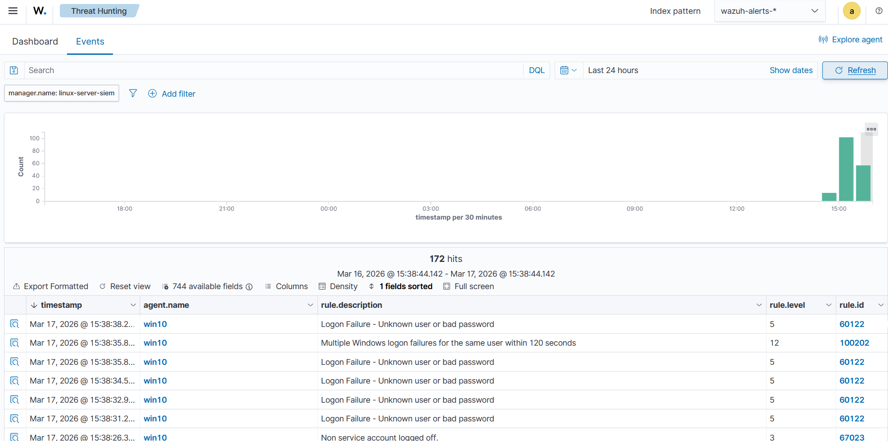
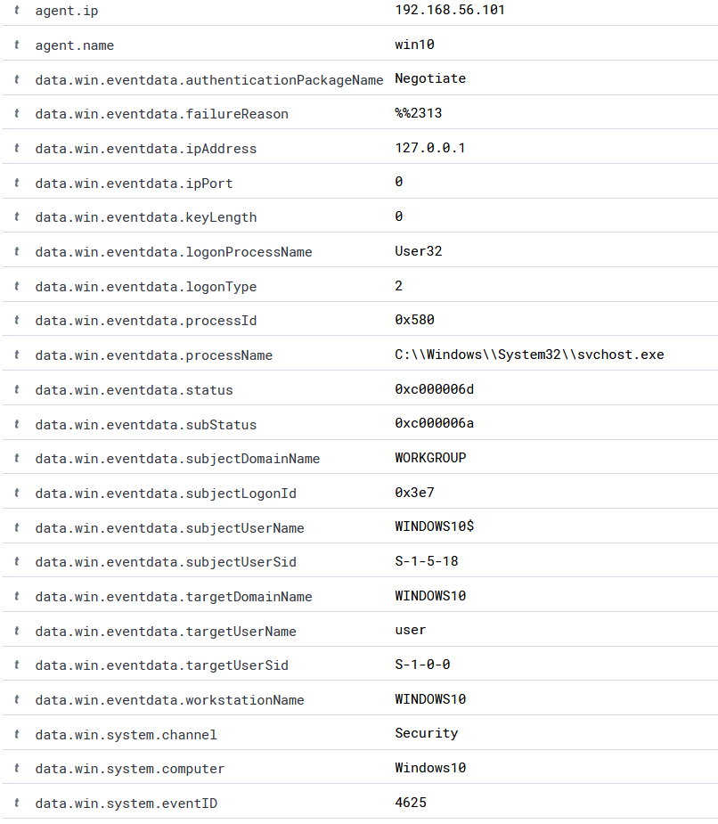
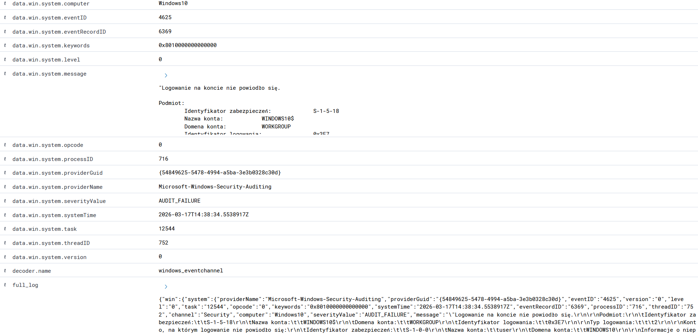

# Lab 02: Detection Engineering

## Introduction

The purpose of this lab was to move from simply collecting logs to consciously creating and tuning detections in a SIEM system. In the previous module, the environment correctly recorded security events from Windows 10, but not all of them were presented as useful alerts. This was particularly visible in the case of the `schtasks` command, which appeared in raw Sysmon logs but did not generate an appropriate alert in the main Wazuh view.

As part of this lab, two custom local rules were created in Wazuh. The first one detected the creation of a scheduled task using `schtasks.exe`, while the second acted as a threshold rule for failed logins, generating an alert only after multiple occurrences of event `4625` within a short period for the same user. In addition, a simple triage playbook was developed to describe how to analyze the most important alerts.

The environment consisted of the same two virtual machines as in Lab 1:

- Ubuntu Server with Wazuh Manager, Wazuh Dashboard, Wazuh Indexer, and Filebeat
- Windows 10 with the Wazuh agent and Sysmon

Logs from the Windows endpoint were sent to the Wazuh manager, then analyzed by rules and presented in the `wazuh-alerts-*` index. When necessary, it was still possible to return to the raw logs in `wazuh-archives-*`, but the goal of this module was to elevate the most important events to the level of full-fledged alerts.

## Environment and Tools

- SIEM server: Wazuh Manager and Wazuh Dashboard on Ubuntu Linux
- Endpoint: Windows 10 with the Wazuh agent
- Telemetry: Windows Event Logs and Sysmon
- Data processing: Filebeat and Wazuh Indexer
- Detection mechanism: local rules in `local_rules.xml`

## Detection Scenarios and Tuning

## 1. Custom Rule for Scheduled Task Creation via `schtasks.exe`

The first task was to solve the issue identified in the previous lab. In Lab 1, the `schtasks /create` command was visible only in raw Sysmon logs, but it did not generate a useful alert in the `wazuh-alerts-*` index. In this module, a local rule was created to detect scheduled task creation based on the `schtasks.exe` process and the contents of the `commandLine` field.

The rule was based on the Sysmon Process Create event and the `image` and `commandLine` fields. Thanks to this, the detection was not based solely on the fact that `schtasks.exe` was launched, but specifically on the use of the `/create` option, which indicates the creation of a new task.

```xml
<rule id="100201" level="10">
  <if_group>sysmon_event1</if_group>
  <field name="win.eventdata.image" type="pcre2">(?i)\\schtasks\.exe$</field>
  <field name="win.eventdata.commandLine" type="pcre2">(?i)\s/create\b</field>
  <description>Sysmon - Scheduled task creation via schtasks.exe</description>
  <options>no_full_log</options>
</rule>
```

After deploying the rule and re-running the test command `schtasks /create`, the event began to appear as an alert with identifier `100201` and level `10`. The alert contained the full command line, process name, user data, and parent process. This means that the problem from the previous module was resolved: the event was no longer visible only in `wazuh-archives-*`, but was elevated to the level of active detection.





## 2. Threshold for a Series of Failed Login Attempts

The second task was to reduce the noise generated by individual failed login attempts. The built-in Wazuh rule recorded each `4625` event separately, which is useful for diagnostic purposes, but does not always provide a sufficient basis for raising a more important alarm. A single failed login attempt may result from a typo or user error, whereas a series of such events within a short period is much more interesting from the perspective of a SOC analyst.

For this reason, a local threshold rule was prepared, referencing the existing rule `60122`, which was responsible for a single failed login. The new rule `100202` generated an alert only when the event occurred five times within 120 seconds for the same user. This way, individual login errors remained visible, but an additional, stronger alert appeared, indicating a more suspicious sequence of events.

```xml
<rule id="100202" level="12" frequency="5" timeframe="120" ignore="120">
  <if_matched_sid>60122</if_matched_sid>
  <same_field>win.eventdata.targetUserName</same_field>
  <description>Multiple Windows logon failures for the same user within 120 seconds</description>
</rule>
```

During the test, a series of failed login attempts was performed against the `user` account. As a result, the individual `60122` alerts were still visible in Wazuh, but an additional new alert `100202` also appeared, with level `12` and the description `Multiple Windows logon failures for the same user within 120 seconds`. In the log details, fields such as `targetUserName`, `subStatus`, and `logonType` were still visible, making it possible to further distinguish between an ordinary user mistake and a more deliberate password-guessing attempt.





## 3. Triage Playbook

After building the custom detection rules, the next step was to prepare a simple triage playbook. Its purpose was to standardize the method of alert analysis and define which fields and actions should be checked after detecting an event.

### 3.1 Scheduled Task Creation via `schtasks.exe`

**Analysis objective:**  
Determine whether the creation of a scheduled task is expected behavior or may represent a persistence attempt.

**What to check:**

- the full command line in `commandLine`
- the task name
- the path to the program launched by the task
- the user executing the command
- the parent process

**When the event is suspicious:**

- the task name looks unusual or tries to imitate a legitimate update
- the task launches an executable from an unusual location
- the command was executed by a regular user
- there is no administrative justification for creating the task

**Next steps:**

- confirm whether the task was created intentionally
- check whether the task still exists in the system
- remove the task if it is unauthorized
- analyze the host for other signs of persistence

### 3.2 Multiple Windows Logon Failures for the Same User Within 120 Seconds

**Analysis objective:**  
Assess whether the series of failed logins is the result of an ordinary user mistake or may indicate a password-guessing attempt.

**What to check:**

- the account name in `targetUserName`
- the number of attempts within a short period
- `subStatus`
- `logonType`
- the login source
- whether the account belongs to a regular user or a privileged account

**When the event is suspicious:**

- the number of attempts increases rapidly
- it concerns a privileged account
- it occurs outside normal working hours
- the login source is unusual
- similar attempts appear for several accounts

**Next steps:**

- confirm with the user whether they were the one attempting to log in
- check whether a successful login appeared after the series of failures
- consider locking the account or resetting the password
- escalate the analysis if the behavior looks like brute force

### 3.3 Account Creation and Addition to the Administrators Group

**Analysis objective:**  
Verify whether the new account and the assignment of administrator privileges were authorized actions.

**What to check:**

- who created the account
- the name of the new account
- who added the account to the Administrators group
- whether both events occurred within a short time frame
- whether there is an administrative justification

**When the event is suspicious:**

- the account was created by a regular user
- the account immediately received administrator privileges
- the account name looks unusual
- there is no justification for such a change

**Next steps:**

- confirm whether the change was authorized
- disable or remove the account if it is unauthorized
- remove the account from the Administrators group
- check other actions performed from that account

## Module Conclusions

- Simply collecting logs is not enough if important events are not presented as clear alerts to the analyst.
- Adding the custom rule `100201` made it possible to convert an event previously visible only in `wazuh-archives-*` into a full alert in `wazuh-alerts-*`.
- The use of the threshold rule `100202` demonstrated that a SIEM can be tuned to distinguish between isolated, low-value events and more suspicious sequences.
- Preparing a simple triage playbook was a natural complement to detection, because generating an alert alone does not complete the analyst’s work.
