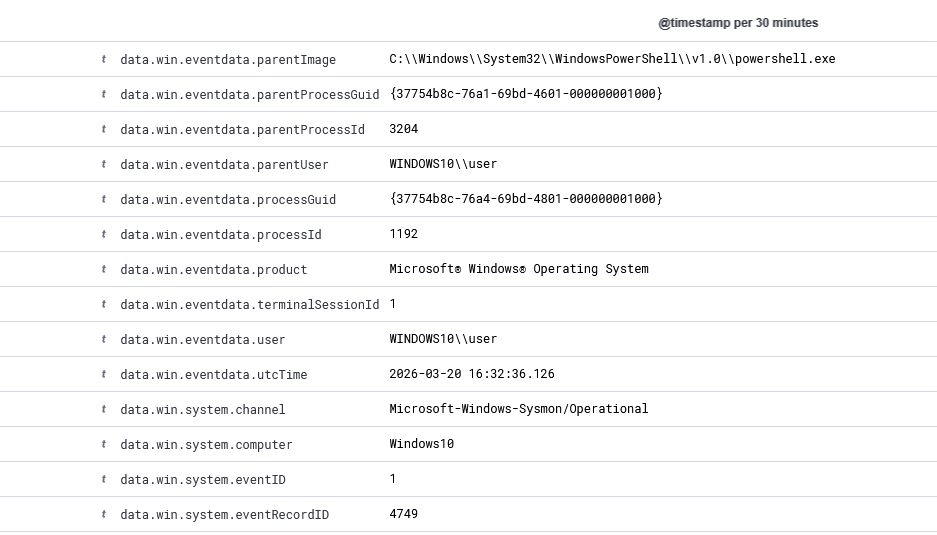

# Lab 03: Incident Triage and Timeline Reconstruction

## Introduction

The purpose of this lab was to practice SOC analyst work based on Windows 10 telemetry collected by Wazuh. As part of the exercise, a simple incident scenario was prepared, consisting of several related actions: launching PowerShell with the default execution policy bypassed, running a simple reconnaissance script, creating a scheduled task as a persistence mechanism, and generating a series of failed logins that ultimately triggered a correlation alert.

Unlike the previous labs, the focus here was placed not only on individual alerts, but also on combining multiple artifacts into one coherent chain of events. Both the `wazuh-alerts-*` index, where Wazuh alerts are visible, and the `wazuh-archives-*` index, which makes it possible to return to raw Sysmon and Windows Event Logs, were used in the analysis.

The environment consisted of two virtual machines:

- Ubuntu Server with Wazuh Manager, Wazuh Dashboard, Wazuh Indexer, and Filebeat
- Windows 10 with the Wazuh agent and Sysmon

## Environment and Tools

- SIEM server: Wazuh Manager and Wazuh Dashboard on Ubuntu Linux
- Endpoint: Windows 10 with the Wazuh agent
- Telemetry: Windows Event Logs and Sysmon
- Data processing: Filebeat and Wazuh Indexer
- Analysis sources: `wazuh-alerts-*` and `wazuh-archives-*`

## Incident Scenario and Analysis

## 1. Launching PowerShell and Running a Simple Script

The first stage of the scenario was launching PowerShell and executing the `inventory.ps1` script from the user’s directory. In the raw logs from the `wazuh-archives-*` index, a sequence of events related to `powershell.exe` was identified, followed by child processes launched by that interpreter.

The event table showed entries for `powershell.exe`, `hostname.exe`, `whoami.exe`, and `schtasks.exe`. What was particularly important was that the `hostname.exe` and `whoami.exe` processes had PowerShell as their parent process and were associated with the execution of the `inventory.ps1` script. This showed that the script was actually executed and performed basic reconnaissance activities on the host.

Although simple, this stage reflects the early phase of attacker or red team operator activity, where after gaining access they want to quickly collect basic information about the system and the user context.

## 2. Persistence via Scheduled Task Creation

The next stage of the scenario was the creation of a scheduled task named `Lab3-InventoryTask` using `schtasks.exe`. The Sysmon event details showed the full command line:

- execution of `schtasks.exe`
- use of the `/create` switch
- task name `Lab3-InventoryTask`
- an action consisting of re-launching PowerShell with the `inventory.ps1` script

The log also showed the parent process `powershell.exe`, confirming that the task was created from the previously launched script or PowerShell session. From a security analysis perspective, such a pattern should be treated as an attempt to establish persistence, meaning the ability to execute code again on the host at a later time.

It is also important that in this case the event was successfully elevated to the alert level by a custom local Wazuh rule. The alert details included the description `Sysmon - Scheduled task creation via schtasks.exe`, rule identifier `100201`, and severity level `10`.

## 3. Series of Failed Logins and Brute-Force Correlation

After the PowerShell and persistence-related activity, a series of failed login attempts to the local `user` account was simulated. In the `wazuh-alerts-*` index, individual alerts appeared for event `4625`, which represents a failed Windows login.

Analysis of one of the log entries showed, among other things:

- `eventID: 4625`
- `targetUserName: user`
- `status: 0xc000006d`
- `subStatus: 0xc000006a`
- `logonType: 2`

This set of fields indicates that the login failed because of invalid credentials for an existing local account. After several such attempts, Wazuh generated an additional correlation alert `100202` with the description `Multiple Windows logon failures for the same user within 120 seconds`. Thanks to this, the analyst does not have to rely solely on individual failed login events, but also receives a clear signal that a whole series of similar events occurred within a short period of time.

This stage clearly demonstrates the difference between a single diagnostic event and a correlation rule that raises the importance of a sequence of potentially suspicious actions.

## Incident Timeline

Based on the collected logs, it is possible to reconstruct a simplified sequence of events:

- around `17:32:42`, activity related to `powershell.exe` was recorded
- around `17:32:44`, the script launched reconnaissance processes, including `hostname.exe` and `whoami.exe`
- around `17:32:48`, the scheduled task `Lab3-InventoryTask` was created using `schtasks.exe`
- around `17:33:55` - `17:34:02`, a series of failed `4625` login attempts occurred
- around `17:34:04`, Wazuh generated the correlation alert `100202`

This timeline shows the progression from script execution, through reconnaissance and persistence, to a separate thread related to failed login attempts. Even if not all of these actions have to belong to a single real attacker, in a lab context they form clear material for practicing event correlation and building analytical hypotheses.

## Module Conclusions

- Analysis in `wazuh-alerts-*` is convenient, but the full picture of an incident often requires going down to raw data in `wazuh-archives-*`.
- The occurrence of `powershell.exe` alone does not provide full context, but linking it with child processes and the later use of `schtasks.exe` makes it possible to build a coherent incident narrative.
- The creation of a scheduled task that launches a PowerShell script should be treated as a potential persistence mechanism and analyzed with increased scrutiny.
- Individual `4625` events may be diagnostic in nature, but a series of them in a short period justifies generating an additional correlation alert.
- The lab demonstrated that effective SOC work does not rely solely on reading individual alerts, but on combining artifacts from multiple sources into one logical chain of events.
